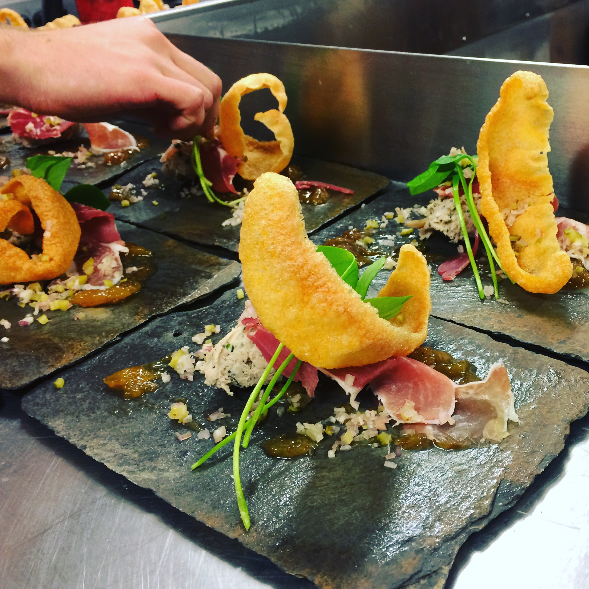
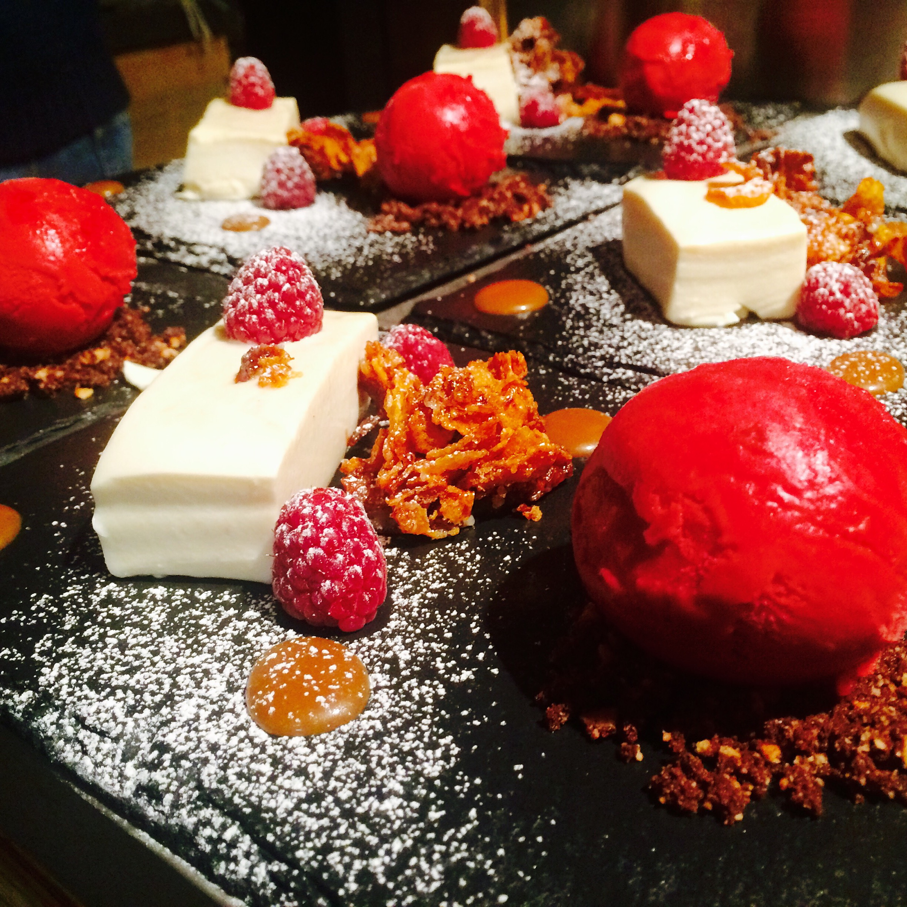

Being a Chef is hard work. Long unsociable hours in a hot and sticky environment, with very little pay. Unless you’re extremely passionate about food, it’s not a career path for everyone.

I fell into the chef world when I was 16/17. I had left school with a job in a restaurant as a waiter. From there I got hours as a Chef and that’s where my cooking career started out.  Through becoming a Chef, I’ve had the privilege of working in the French Alps for 6 years and working a summer in Greece.

My Grandparents where both farmers and I spent most of my summers with them, helping out wherever possible. My mum was a trained Chef and my Nan is a great cook, so food was always amazing at home! This is where I learnt the basics of cooking.

I worked as a Chef for 10years before I decided to move back to the UK and study to become a Software Developer. I love cooking, but I felt it was time to move on from the industry and learn something new.
 
I’ve always had a keen interest in technology. While growing up, I was always building things (k-nex, lego etc), eventually progressing to building computers and repairing phones. I love to experiment with technology, which led me down the route of Software Development.

For most people, it’s difficult to think that cooking and coding have any similarities. But there are surprisingly, quite a few!!

**Being Open Minded:** No one will ever know everything there is to know about cooking or coding. Both are constantly changing and improving. Having an open mindset and listening to others suggestions is important in order to grow and possibly make your end product better.
 
**Creativity:** You need to be somewhat creative.  To come up with new dishes/menus you need to be able to use the techniques and recipes to come up with something different.  The same goes for coding, you need to be able to come up with solutions to a technical problem using the tools and languages you know.

**Basic Concepts:** Cooking and coding have some basic concepts that are important to understand.  Some basic skills for cooking would be knowing your knives and cuts, making a reux, knowing the different cooking techniques (roasting, frying, blanching…). Some basic coding skills would be knowing how to set up an HTML page, navigating through your editor and the console, how to troubleshoot, and more.

**Types:** There are several different routes you can take in cooking and in coding.  To start in either industry, you need to pick one and grow from there. In cooking, you can be a baker, a grill chef, a pizza maker, a chocolatier, and more. For coding, it’s more about the different languages: JavaScript, Python, Ruby, C#, and etc.
 
**Frustration:** This is a given for both industries. If you don’t like it, I would recommend a different career path entirely.  But then what job isn’t frustrating?!  There are definitely more frustrations with coding than with cooking. Missing a semicolon? Fatal error. Pan too hot? Burnt food. 

I will always love to cook.  We all need to eat, right!? With software development, I’ve found a career that lets me be creative in many of the same ways that cooking does.  Coding is also moving a lot quicker in terms of updating and getting more efficient. I love learning new things on a daily basis and this is the main reason why I decided to become a Software Developer.

Knowing the similarities made my transition over much easier. Now I can proudly say that I am a Software Developer and that I love what I do!
