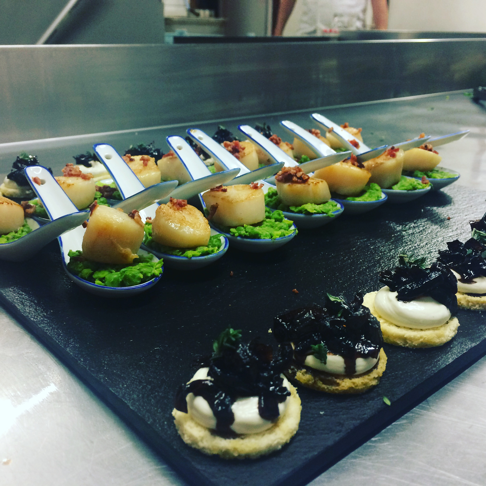
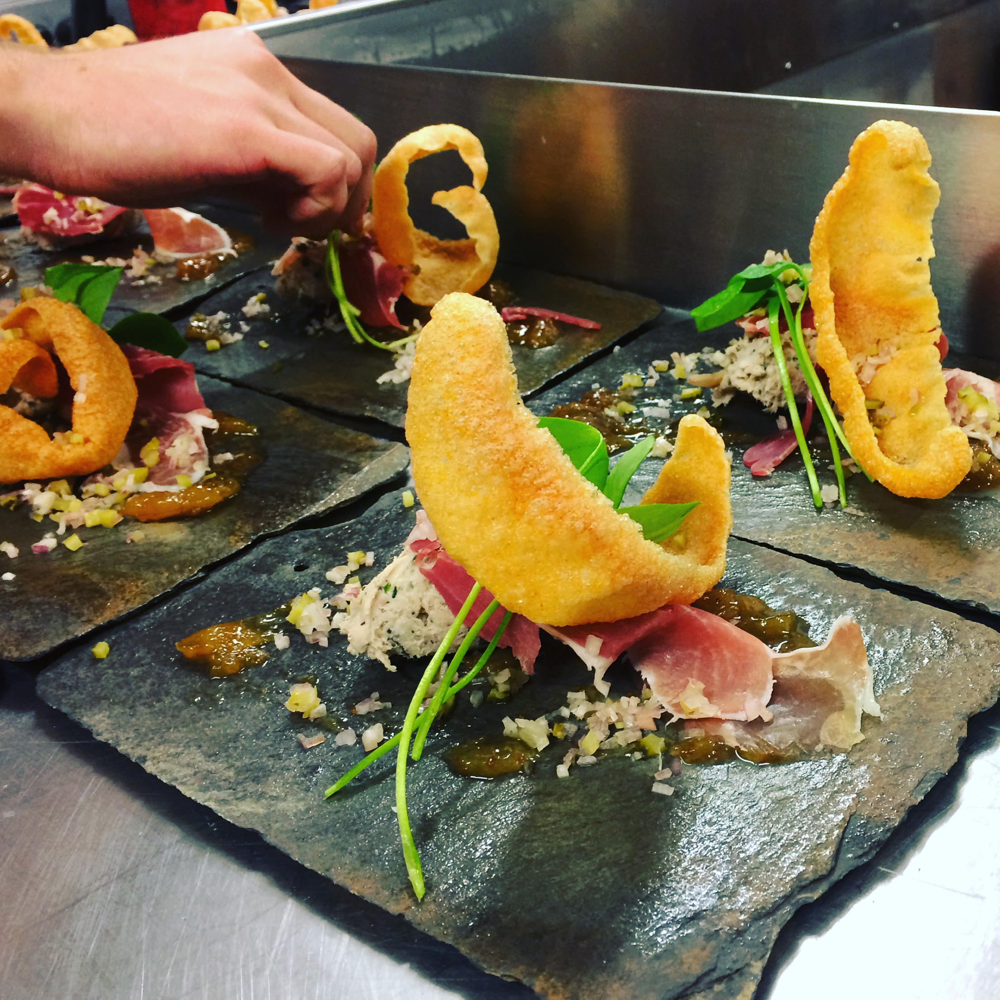
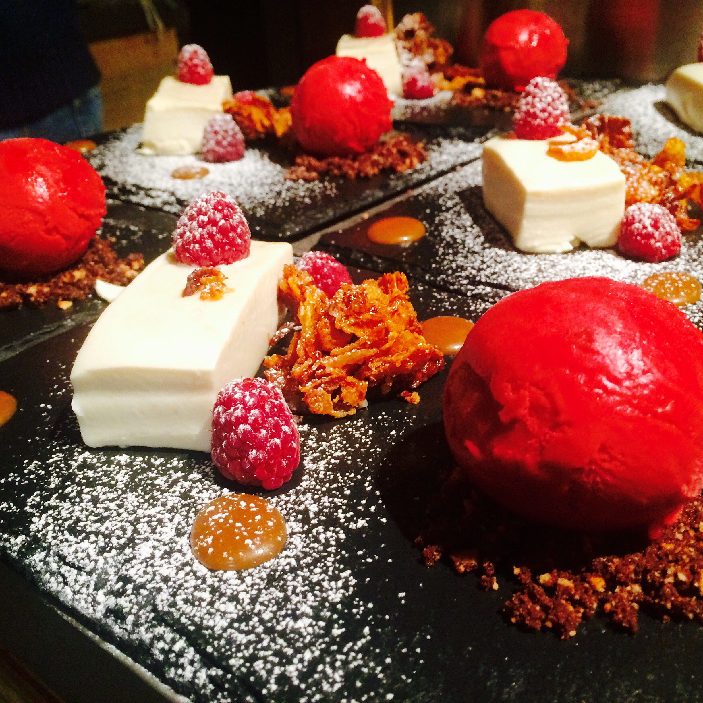

Being a Chef isn't for everyone. Long unsociable hours in a hot and sticky environment, with very little pay. It's really only for those who are extremely passionate about food.

I fell into cheffing when I was 16/17. In my last year of school I was working in a restaurant as a waiter. From there I got hours as a Kitchen Ported, washing the dishes. I got rather efficient at it and started to ask the Head Chef for more jobs to do. That’s where my cooking career started out.  Through becoming a Chef, I’ve been able to work in some of the worlds most amazing places!
My Grandparents farmers and I spent most of my summers with them, helping out wherever possible. My Mum was a trained Chef and my Nan is a great cook, so I was always spolit at home! This is where I learnt the basics of cooking.

I moved to France at the age of 20, where I lived for 6 years, working over the seasonal periods. In between the seasonal work, I would travel for a few weeks until the next season began or I would go back to Belfast to work as a relief Chef, working in a variety of kitchens. I never seemed to last very very long in an industrial kitchen. I would get bored of cooking the same dish over and over again and have to find another job elsewhere. 

During this period I thought I would teach myself how to code. I would spend the bad weather days learning and building websites and apps for friends and family. Unsurprisingly it all made sense to me and I just wanted to learn more and imporve my knowledge. 

I’ve always had a keen interest in technology. While growing up, I was always building things (k-nex, lego etc), eventually progressing to building computers and repairing phones. I love to experiment with technology, which led me down the route of Software Development.

For most, it’s difficult to think that cooking and coding have any similarities. But there are surprisingly, quite a few!!

**Being Open Minded:** No one will ever know everything there is to know about cooking or coding. Both are constantly changing and improving. Having an open mindset and listening to others suggestions is important in order to grow and improve your end product.
 
**Creativity:** You need to be creative. To come up with new dishes/menus and use different techniques and recipes to come up with something different. The same goes for coding, you need to be able to come up with solutions to a technical problem using the tools and languages you know.

Websites are broken down into sectors, which is  quite similar to recipes. You  get a list of ingredients and a list of instructions on how to get to the end result. 

A full stack developer combines and manages and manages each sector to build out a website/application:
	* Login and authentication
	* Internal Chat system
	* Post system
	* Website hosting
	
	
A chef uses multiple recipes in and a dish:
	* Pickled cucumber 
	* Pea puree
	* Pan fried scallops
	* Roasted lemon puree

**Basic Concepts:** Cooking and coding have some basic concepts that are important to understand.  Some basic skills for cooking would be knowing your knives and cuts, making a reux, knowing the different cooking techniques (roasting, frying, blanching…). Some basic coding skills would be knowing how to set up an HTML page, navigating through your editor and the console, how to troubleshoot, and more.

**Job Roles:** There are several different routes you can take in cooking and in coding.  To start in either industry, you need to pick one and grow from there. In cooking, you can be a baker, a grill chef, a pizza maker, a chocolatier etc. For coding, it’s more about the different languages: JavaScript, Python, Ruby, C#, and etc. and weither you want to focus on front-end or back-end development.
 
**Frustration:** This is a given for both industries. If you don’t like it, I would recommend a different career path entirely.  But then what job isn’t frustrating?!  There are definitely more frustrations with coding than with cooking. Missing a semicolon? Fatal error. Pan too hot? Burnt food. 

I will always love cooking.  We all need to eat, right!? With software development, I’ve found a career that lets me be creative in many of the same ways that cooking does.  The software industry is also moving a lot quicker in terms of updating and getting more efficient. I love learning new things on a daily basis and this is the main reason why I decided to become a Software Developer.

Knowing the similarities made my transition over much easier. Now I can proudly say that I am a Software Developer and that I love what I do!
