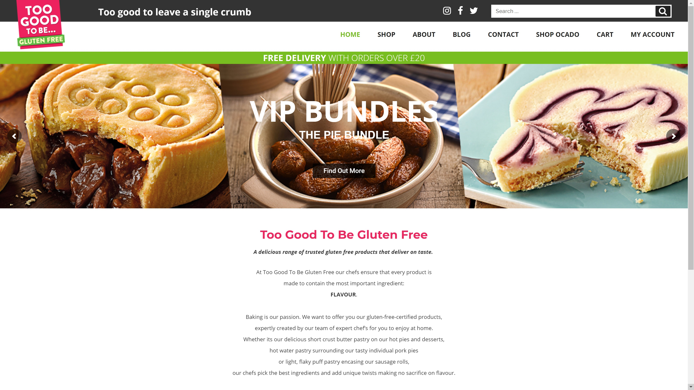

Too Good To Be, is a sister company of Ocado, which specialises in Gluten free products for their clients.

##The Brief
Their website needed a complete overhall and redesign. They needed to capture their users attention and improve the customers journey, from browsing through the products and converting them to paying customers. 

##The Result
I worked closely with [Digital Works Agency](https://digitalworksagency.com) on the project to achieve the end result. The new site has increased sales volumes leaving the brand happy with their new website.