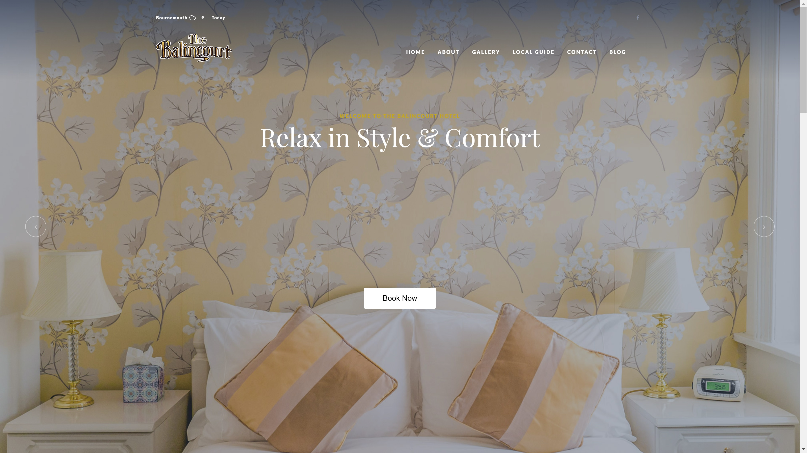

##Project Overview
The Balincourt Bournemouth Guest House offers award winning luxury accommodation in one of Bournemouth’s most beautiful settings. 

I worked closely with St James Studio to develop a scalable Wordpress solution capable of handling high volumes of international traffic with minimal impact on the website’s speed and performance. With the majority of traffic originating from smart phones and tablets, created the Firefly website using responsive design to ensure that the customer experience was consistent and optimised across all devices.

Since launch, Eyekiller are working closely with the Firefly marketing team to develop and implement a marketing strategy focusing on digital channels. In addition to the ongoing management of digital services including pay per click adverting and search engine optimisation; the Eyekiller Digital Marketing team are engaged in a knowledge transfer training programme with the Firefly team to develop in-house digital capabilities.